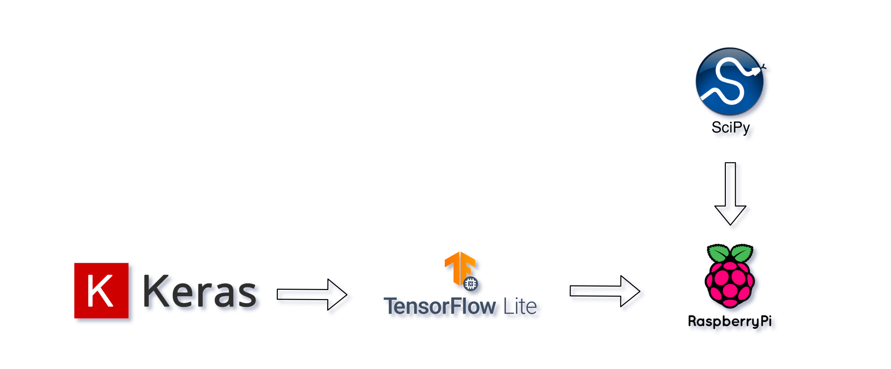

## Introdução

Este documento tem por objetivo apresentar a discussão criada para o exercício extra da matéria de \texttt{Análise Estatística e Espectral de Processos Estocásticos}. Para este exercício é esperada a discussão de um programa que apresente o conceito de Preparação Generalizada de Dados (PGD) e incorpore uma técnica de análise (Estatística ou Espectral) vista em sala de aula. Além disto, é esperado a apresentação de formas de uso de ferramentas como a interpolação pchip nas etapas de normalização de dados e uma Rede Neural Recorrente (RNR) no módulo de previsão de dados.

Para a solução do problema apresentado, o presente trabalho aplica as ferramentas Keras, TensorFlow Lite, Pandas e SciPy, considerando a necessidade de utilização destes *softwares* no contexto de microcomputação, que neste caso está sendo representada pelo RaspberryPi 4.

## Seleção das ferramentas

Considerando que a plataforma utilizada para a conceituação sobre a utilização das ferramentas vistas em sala de aula em microcomputador é o RaspberryPi, fez-se necessário definir as bibliotecas de código utilizada, não apenas por sua facilidade de uso, mas também por ter suporte e conseguir trabalhar sob a arquitetura ARM64 do processador do RaspberryPi.

Após esta consideração, foi realizado a seleção das seguintes ferramentas: (i) Keras\footnote{\href{http://keras.io/}{keras.io}}, para a criação em alto nível das RNN; (ii) TensorFlow Lite\footnote{\href{https://www.tensorflow.org/lite}{tensorflow.org/lite}}, para que modelos gerados com o Keras sob o TensorFlow sejam facilmente portado para ambientes embarcados; (iii) Pandas, para a manipulação generalizada de dados; e (iv) SciPy, para a rápida utilização do método de interpolação pchip.

De maneira geral, o fluxo considerando ao utilizar estas ferramentas é apresentado na Figura abaixo.

```{r fig1, echo = FALSE, fig.align = "center", fig.cap="Fluxo de utilização", out.width = '80%'}

```

Seguindo este fluxo, as ferramentas selecionadas neste trabalho podem ser aplicadas a contextos de microcomputação. Abaixo é feita a discussão sobre cada uma dessas ferramentas quando aplicadas ao contexto de microcomputação.

## Preparação Generalizada de Dados

Ao considerar os conceitos de PGD vistos em sala, a biblioteca Pandas está sendo considerada, uma vez que esta, fornece recursos para a leitura e escrita de diferentes formatos de dados. Como apresentado na documentação oficial do projeto\footnote{\href{https://pandas.pydata.org/pandas-docs/stable/user_guide/io.html}{pandas.pydata.org}}, atualmente o projeto suporta 18 tipos diferentes de dados na leitura e escrita, estes variando desde arquivos simples de dados, como CSV até leitura de dados em serviços online como Google BigQuery\footnote{\href{https://cloud.google.com/bigquery/?hl=pt-BR}{Google BigQuery}}. Além disto, as versões distribuídas oficialmente pelo projeto Pandas, contam com suporte a arquitetura ARM64, requisito fundamental para a aplicação em microcomputação. 

Junto ao pandas, na etapa de PGD é possível aplicar o SciPy, esta que é uma biblioteca com muitas funcionalidades para a computação numérico-científica. Com esta biblioteca, que também possuí versões para arquiteturas ARM64, é possível aplicar diferentes conjuntos de interpolações, em especial a PCHIP, módulo já implementado e disponível para uso na biblioteca.

Desta forma, ao gerar um módulo de PGD com estas bibliotecas, tem-se o uso completamente compatível e eficiente dos recursos computacionais de microcomputação.

## Redes Neurais em Microcomputação

Como citado anteriormente, um dos objetivos deste exercício é apresentar uma abordagem a utilização de redes neurais recorrentes no contexto de Microcomputação. Para este caso, o ecossistema oferecido pelo Google, TensorFlow, ajuda e facilita bastante o processo de tal aplicação. Considerando que todo o treinamento da rede será feito em uma máquina com muitos recursos computacionais e em seguida portado para ambientes embarcados, o uso das bibliotecas Keras e TensorFlow Lite pode ser considerado.

Neste contexto, o Keras é utilizado por fornecer uma interface de programação de alto nível para a criação das redes neurais, neste caso, RNNs, em seguida, o modelo gerado com o Keras pode ser portado para um ambiente embarcado através da aplicação do TensorFlow Lite, que adapta o modelo para que este seja leve e rápido de ser executado.

## Conclusão

Desta forma, é possível concluir que, através do uso de ferramentas *open source*, maduras para ambientes de produção e execução em larga escala, pode-se configurar e criar um ambiente de execução em contextos de microcomputação, estas que são cada vez mais úteis e necessárias para a solução dos mais variados tipos de problemas.
